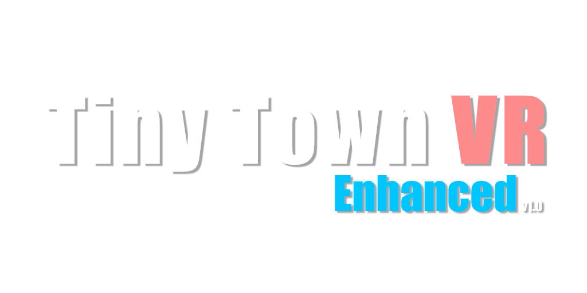
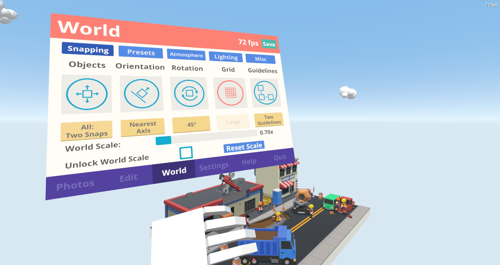
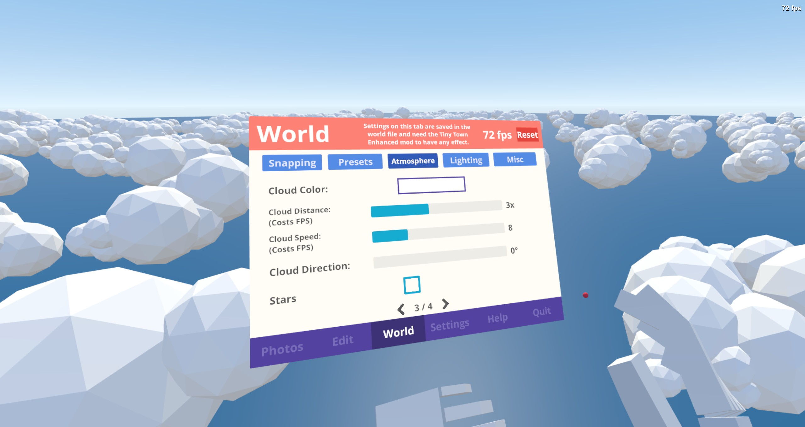
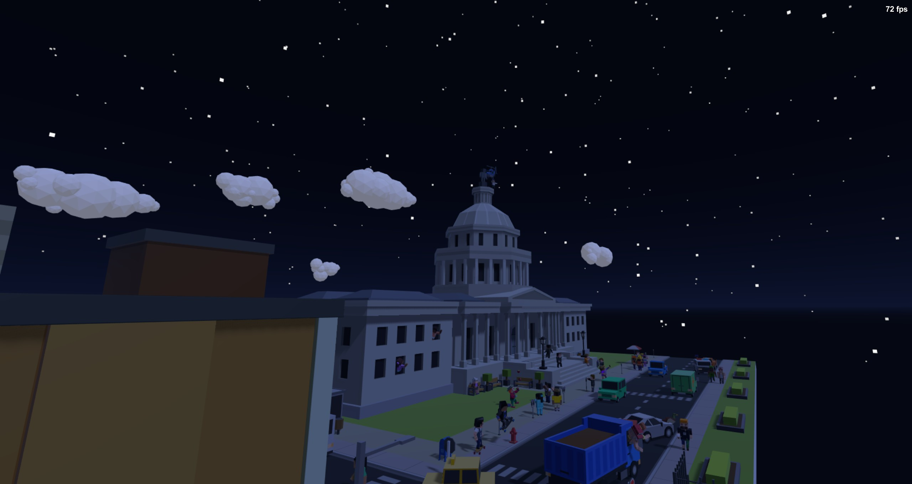
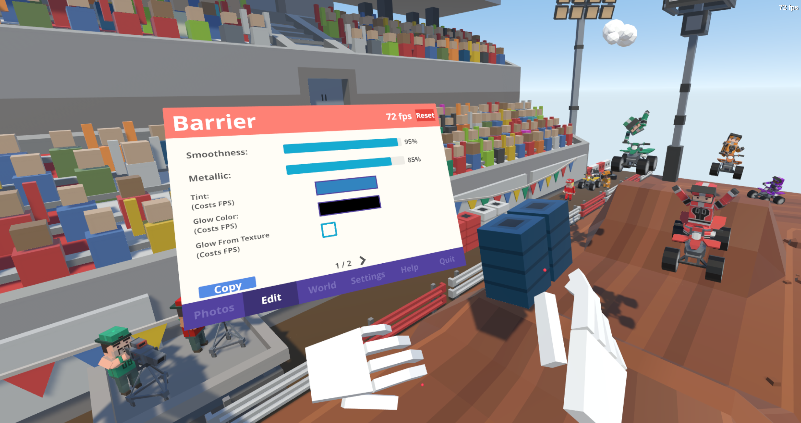

 
**TTVR Enhanced** is an overhaul to the VR game Tiny Town that adds a ton of new features, fixes and improvements.

My goal with this mod was to fix a bunch of the major issues with the base game as well as expanding on areas of the game that had little or no depth to them while keeping the original feel of the game.

# Installation

**REQUIRES [BepInEx v5](https://github.com/BepInEx/BepInEx)**

Download the latest `Win64 BepInEx 5` and extract the zip contents into the game folder.  
   
Download the latest `Tiny Town Enhanced` archive from releases and extract the contents into the game folder as well.

Run the game. The help panel on the left in the main menu should read **Tiny Town VR Enhanced \<Version\>**.

**Thanks to the BepInEx team\!**

# Changes and Additions
- Processing Workshop Items bug, 300 item limit bug, Workshop items not being removed bug are fixed.
- Overhauled World Select and Create World menus: rename, custom thumbnails, duplicate, export/import saves, workshop and default worlds are now templates.
- Option to auto subscribed to missing items when loading a world.
- Autosaving, Manual Saving and Backups
- Edit World and Item properties: Sky, Atmosphere, Lighting, Stars, Moving Clouds, Item Emission, Item Color Tinting, Item Transparency and more.
- Expanded settings menu: Stick based movement options, Video settings, Movement Vignette and more.
- Unlockable world scale, 0.01x to 100x
- Build menu: search, sorting, author filter, arrow navigation and Workshop author names
- Worlds edited with the mod are still compatible with the vanilla game.
- and more.

# Gallery

# Disclaimer

**Claude** was used in the making of this mod.
